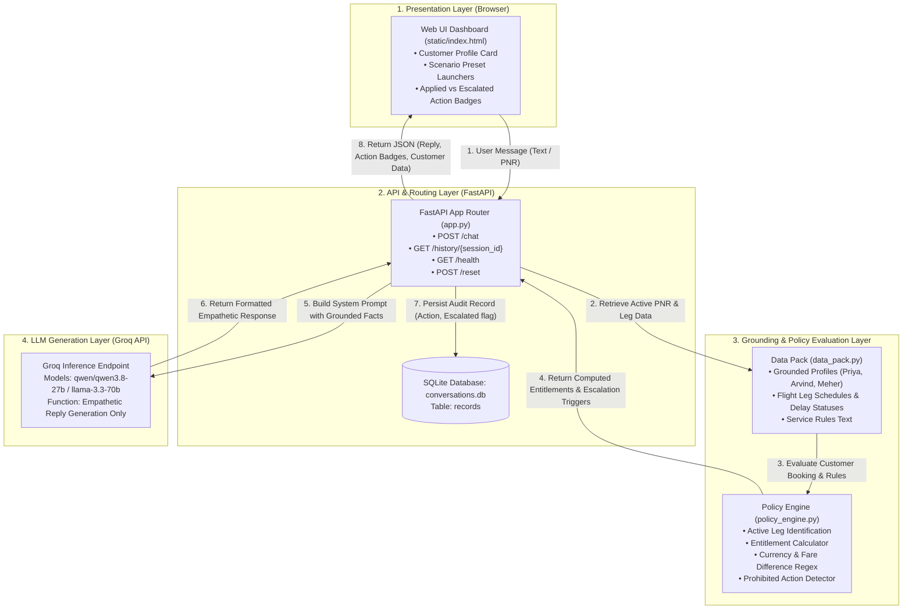
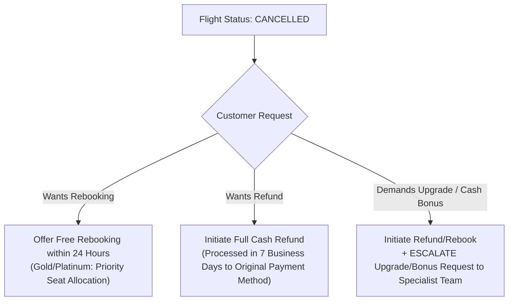
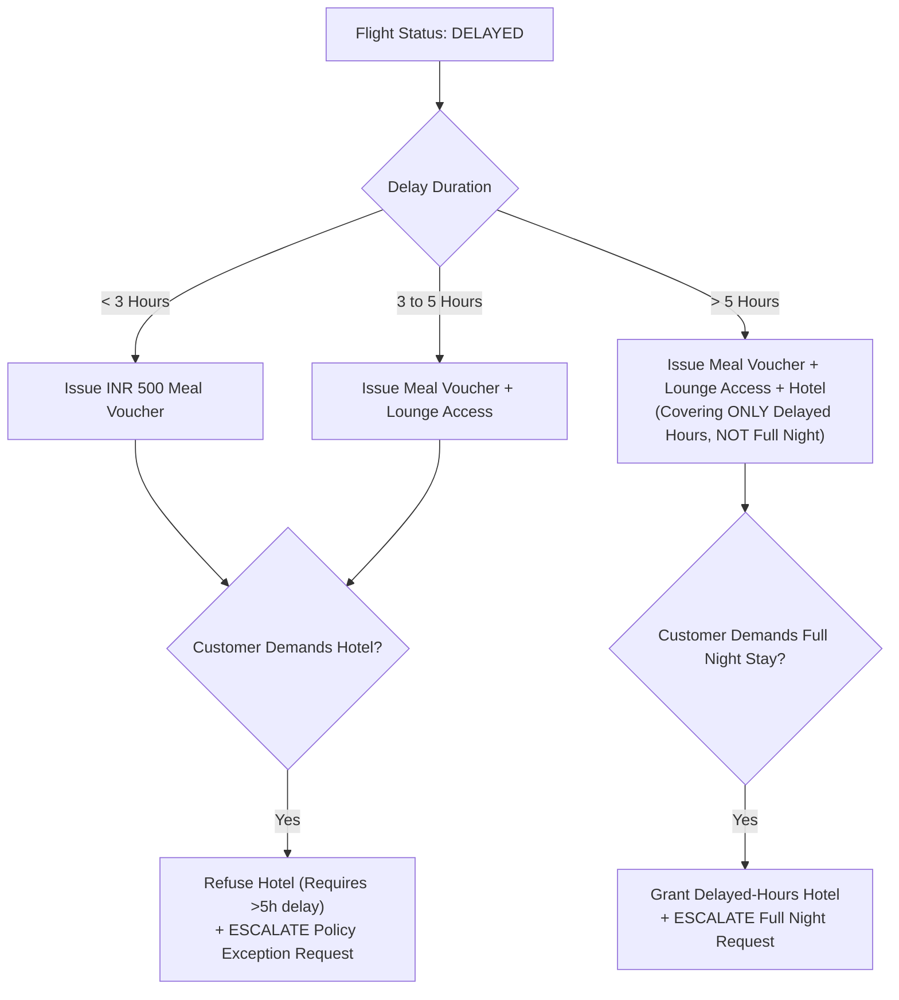
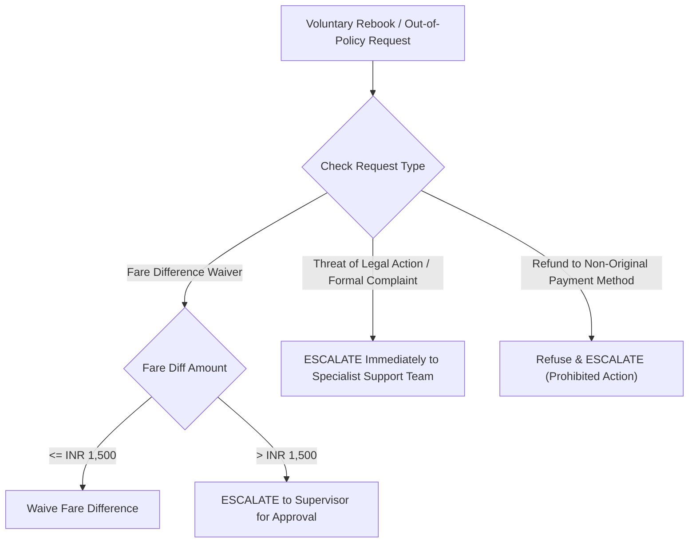

# System Architecture & Process Flow Specification

This document provides a comprehensive technical breakdown of the architecture, component interaction, process flow, and policy decision trees for the **Customer-Facing Resolution Agent (Airline Disruption)**.

---

## 1. Architecture Overview & Design Philosophy

The core architectural requirement for an airline disruption resolution system is **strict deterministic compliance**. Letting a language model compute delay compensation thresholds or approve policy waivers introduces unacceptable risk of hallucination (e.g., approving unauthorized cash bonuses or free business-class upgrades).

To solve this, the application implements a **Hybrid Decoupled Architecture**:

1. **Deterministic Logic Layer (Python)**: Handles 100% of policy math, entitlement calculations, currency regex parsing, and escalation detection.
2. **Generative Language Layer (Groq LLM)**: Handles 100% of customer empathy, tone standardization, and natural language explanation using grounded facts injected by the logic layer.

---

## 2. High-Level Flowchart Architecture



---

## 3. End-to-End Sequence & Process Flow

```
==================================================================================================
                                    END-TO-END PROCESS FLOW
==================================================================================================

[ User / Browser ]    [ FastAPI Router ]   [ Policy Engine ]    [ Groq LLM API ]    [ SQLite Audit DB ]
        │                     │                    │                   │                     │
        │ 1. POST /chat       │                    │                   │                     │
        │────────────────────>│                    │                   │                     │
        │                     │ 2. Resolve PNR &   │                   │                     │
        │                     │    Active Leg      │                   │                     │
        │                     │───────────────────>│                   │                     │
        │                     │                    │ 3. Compute        │                     │
        │                     │                    │    Entitlements & │                     │
        │                     │                    │    Escalations    │                     │
        │                     │                    │                   │                     │
        │                     │ 4. Return Facts    │                   │                     │
        │                     │<───────────────────│                   │                     │
        │                     │                                        │                     │
        │                     │ 5. POST Chat Completion (System Prompt)│                     │
        │                     │───────────────────────────────────────>│                     │
        │                     │                                        │                     │
        │                     │ 6. Generated Empathetic Reply Text    │                     │
        │                     │<───────────────────────────────────────│                     │
        │                     │                                                              │
        │                     │ 7. Write Record (session_id, action_taken, escalated)        │
        │                     │─────────────────────────────────────────────────────────────>│
        │                     │                                                              │
        │ 8. JSON Response    │                                                              │
        │<────────────────────│                                                              │
```

---

## 4. Policy Decision Trees & Guardrail Rules

### 4.1 Cancellation Rebooking & Refund Decision Tree



### 4.2 Delay Compensation Decision Tree



### 4.3 Fare Difference Waiver & Prohibited Actions Matrix



---

## 5. Security, Auditability, and Anti-Hallucination Guardrails

1. **System Prompt Fact Pinning**: The system prompt injects `json.dumps(facts)` containing `computed_entitlement` and `escalation_reasons`. The LLM is explicitly forbidden from generating claims outside these facts.
2. **Audit Logging**: Every turn writes `session_id`, `ts`, `role`, `message`, `action_taken`, and `escalated` flag to SQLite database `conversations.db`.
3. **Session Reset Isolation**: Each scenario execution starts with a clean session to prevent cross-customer data leakage.
