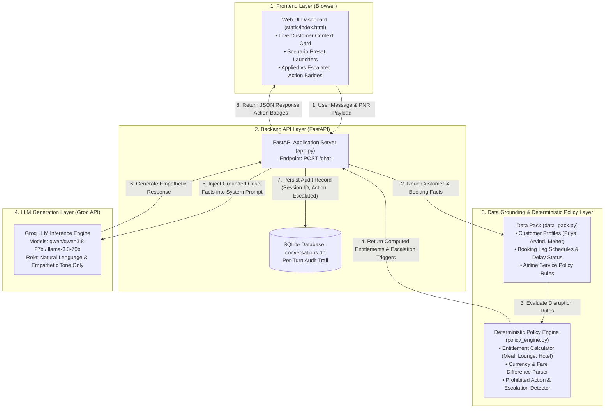

# Airline Disruption Customer-Facing Resolution Agent

Assignment 3 Submission — Customer Resolution & Policy Guardrail System

This project implements an automated customer resolution agent for airline flight disruptions. The system decouples policy calculation from natural language response generation: Python logic computes entitlements and detects prohibited actions deterministically, while the Groq LLM standardizes customer communications.

---

## System Architecture Diagram

### Flowchart Architecture 



---

### Component Sequence Flow (Detailed Architecture)

```
===================================================================================
                   AIRLINE RESOLUTION AGENT — ARCHITECTURE FLOW
===================================================================================

  [ 1. FRONTEND DASHBOARD ]
    User types message or selects scenario preset in static/index.html
      │
      │ HTTP POST /chat { session_id, message }
      ▼
  [ 2. FASTAPI ROUTER (app.py) ]
    Extracts PNR from message or retrieves active session PNR
      │
      │ Read Customer Profile & Flight Status
      ▼
  [ 3. DATA PACK GROUNDING (data_pack.py) ]
    Provides exact customer profile (Priya/Arvind/Meher) and flight leg facts
      │
      │ Compute Entitlements & Escalation Rules
      ▼
  [ 4. DETERMINISTIC POLICY ENGINE (policy_engine.py) ]
    • Computes exact delay compensation (Meal / Lounge / Hotel hours only)
    • Parses currency and fare differences (e.g. ₹2,000 > ₹1,500 threshold)
    • Detects prohibited requests (Upgrades, Full night stays, Legal threats)
      │
      │ Inject Grounded Facts & Entitlements (LLM cannot alter numbers)
      ▼
  [ 5. GROQ LLM INFERENCE LAYER ]
    • Formulates polite, empathetic response following airline tone guidelines
    • Confirms approved entitlements and explains escalated out-of-policy items
      │
      │ Generated Response Text
      ▼
  [ 6. AUDIT LOGGING & UI RESPONSE ]
    • Log transaction to SQLite database table `records`
    • Send JSON response to frontend with APPLIED / ESCALATED visual badges
===================================================================================
```

---

## System Overview

- **Deterministic Policy Math**: Entitlements, delay thresholds, refund eligibility, and fare difference caps are processed entirely in Python (`policy_engine.py`).
- **Grounded LLM Generation**: System prompts ingest live case facts from `data_pack.py`. The LLM cannot approve out-of-policy items or hallucinate unauthorized compensation.
- **Prohibited Action Escalation**: Automatic detection for fare waivers exceeding INR 1,500, unapproved upgrades, full-night hotel stays, non-original refund methods, and legal or formal complaints.
- **Audit Logging**: Per-turn audit trail recorded in an SQLite database storing session IDs, timestamps, role responses, applied policy actions, and escalation statuses.

---

## Technical Stack

- **Backend Framework**: Python 3.10+, FastAPI, Uvicorn, Requests, SQLite3
- **Policy Engine**: Deterministic Python regex and rule evaluation
- **LLM Integration**: Groq Chat API (`qwen/qwen3.8-27b`, `openai/gpt-oss-20b`, `llama-3.3-70b-versatile`)
- **Frontend Dashboard**: HTML5, Vanilla CSS3 (Custom Responsive Layout), Vanilla JavaScript ES6

---

## Setup and Local Execution

### 1. Environment Setup

```bash
python -m venv myenv

# Windows (PowerShell):
.\myenv\Scripts\activate

# macOS / Linux:
source myenv/bin/activate

pip install -r requirements.txt
```

### 2. Configuration

Create a `.env` file in the root directory (refer to `.env.example`):

```env
GROQ_API_KEY=your_groq_api_key_here
```

### 3. Running the Server

```bash
uvicorn app:app --reload --port 8000
```

Access the interface in your browser at `http://localhost:8000`.

---

## Test Execution

Run policy engine unit tests and end-to-end scenario tests:

```bash
# Run unit tests
python test_policy_engine.py

# Run scenario integration tests
python test_scenarios.py
```

---

## Assignment Scenario Coverage

| Scenario | Customer & PNR | Issue | Policy Entitlement & Action |
|---|---|---|---|
| **Scenario 1** | Priya Nair (`SK4821X`) | Flight SK-204 Cancelled | Free rebooking within 24h OR full refund. Gold tier priority seating applied. |
| **Scenario 1 (Follow-up)** | Priya Nair (`SK4821X`) | Demands refund + business class upgrade | Refund processed. Business class upgrade refused and escalated. |
| **Scenario 2** | Arvind Kulkarni (`TR1190B`) | Flight SK-118 Delayed 4h | Meal voucher + lounge access issued. Hotel stay refused (requires >5h delay) and escalated. |
| **Scenario 3** | Meher Kaur (`WL7742`) | Flight SK-305 Delayed 6h | Meal + lounge + hotel (delayed hours only) issued. Full-night stay refused. INR 2,000 fare difference waiver escalated (> INR 1,500 cap). |

---

## Repository Structure

```
.
├── app.py                # FastAPI endpoints (/chat, /health, /history, /reset)
├── data_pack.py          # Customer profiles, booking records, and service rules
├── policy_engine.py      # Deterministic entitlements and escalation detector
├── test_policy_engine.py # Unit test suite
├── test_scenarios.py     # Scenario integration test suite
├── requirements.txt      # Project dependencies
├── README.md             # Documentation
├── .env.example          # Environment variables template
└── static/
    └── index.html        # Responsive resolution dashboard UI
```

---

## Deployment Instructions

To deploy to hosting platforms like Railway or Render:

1. Build Command: `pip install -r requirements.txt`
2. Start Command: `uvicorn app:app --host 0.0.0.0 --port $PORT`
3. Environment Variable: Set `GROQ_API_KEY` in deployment settings.
